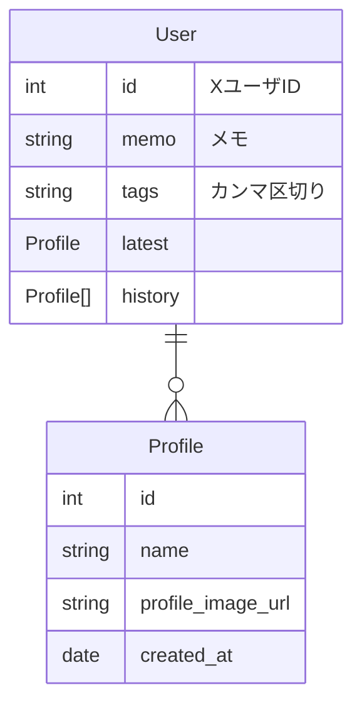

# データ設計

```mermaid
erDiagram
  User {
    int id "XユーザID"
    string memo "メモ"
    string tags "カンマ区切り"
    Profile latest
    Profile[] history
  }

  Profile {
    int id
    string name
    string profile_image_url
    date created_at
  }

  User ||--o{ Profile : ""
```
