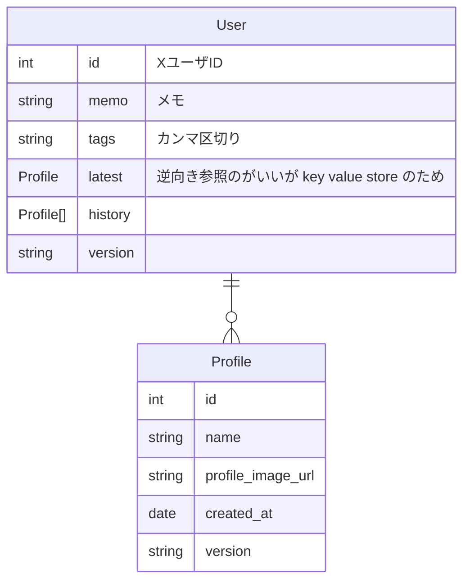

# データ設計

localStorage を利用

```mermaid
erDiagram
  User {
    int id "XユーザID"
    string memo "メモ"
    string tags "カンマ区切り"
    Profile latest "逆向き参照のがいいが key value store のため"
    Profile[] history
    string version
  }

  Profile {
    int id
    string name
    string profile_image_url
    date created_at
    string version
  }

  User ||--o{ Profile : ""
```
